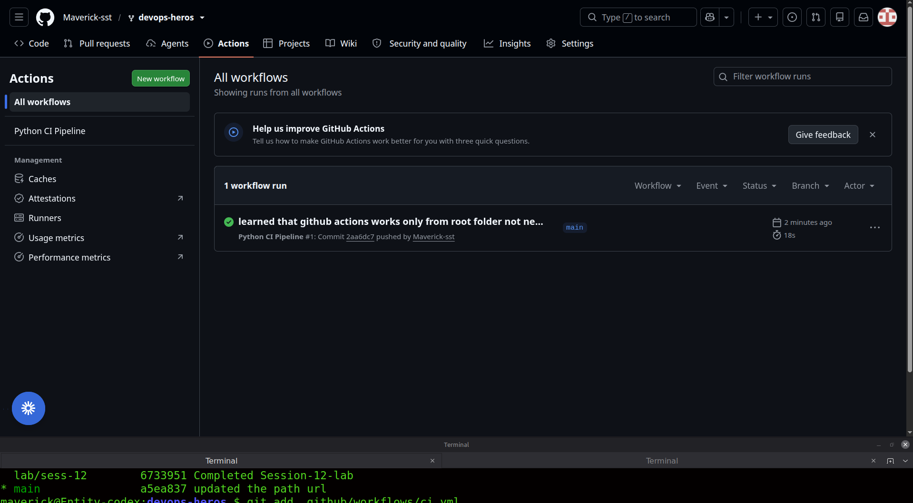
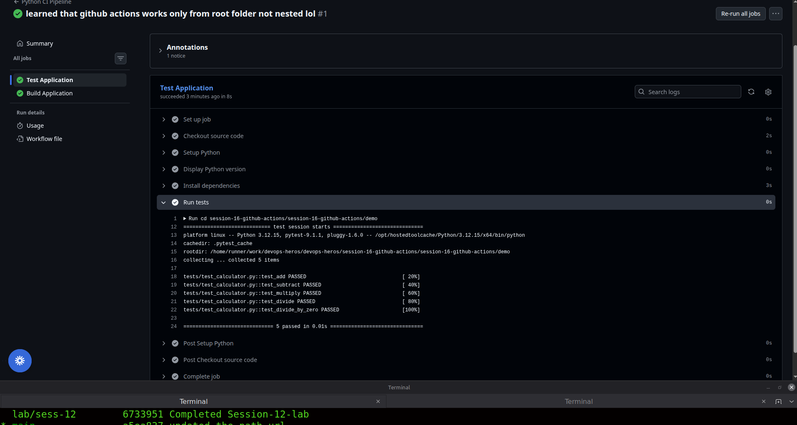
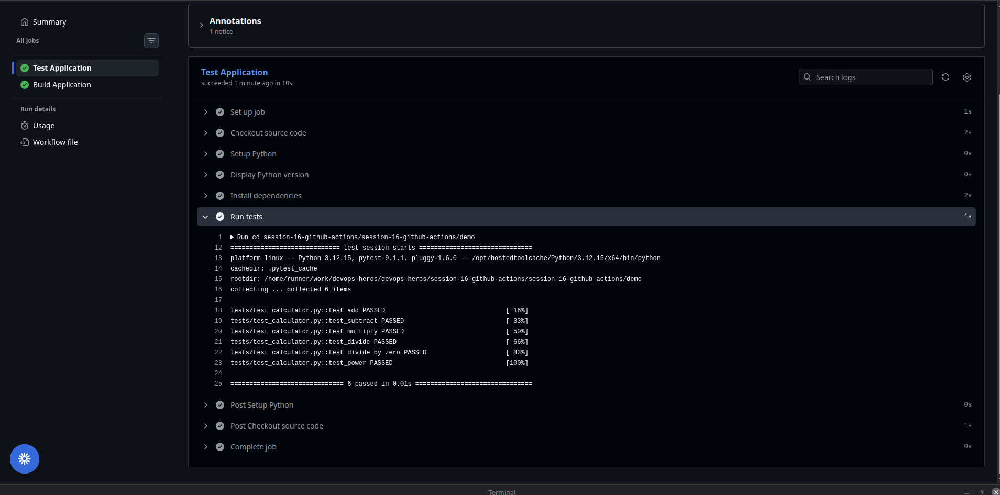
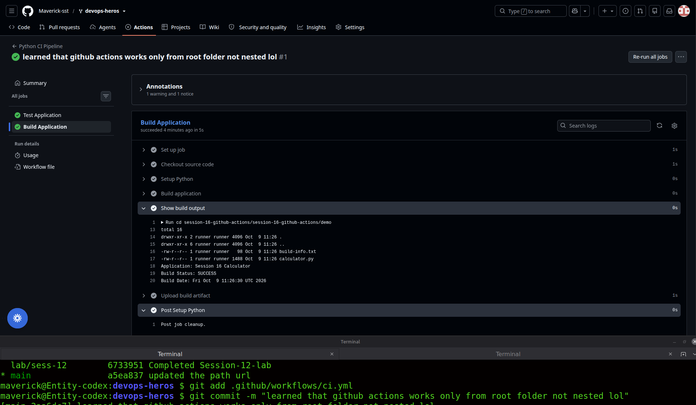

# Session 16: CI/CD & GitHub Actions

## Screenshots

The demo workflow screenshots are stored in `./screenshots/` and should be referenced with relative markdown paths so they render correctly in GitHub.









## What we will build

```text
Developer
    ↓
git push
    ↓
GitHub Repository
    ↓
GitHub Actions
    ↓
┌─────────────────────┐
│ CI Pipeline         │
│                     │
│ Checkout code       │
│ Setup Python        │
│ Install dependencies│
│ Run tests           │
│ Create artifact     │
└─────────────────────┘
    ↓
Build/Test PASS
    ↓
Artifact available
```

GitHub workflow files are YAML files stored under `.github/workflows/`. A workflow contains jobs, and each job contains steps that execute on a runner.  

---
