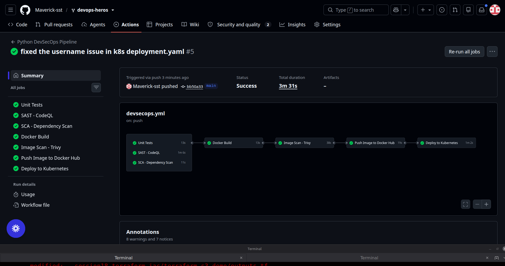

# ⚡ hey-cicd — DevSecOps Dashboard

## Screenshots

The deployment screenshots for this demo are stored in `./screenshots/` and should be referenced with relative GitHub paths.



## 📁 Project Structure

```
hey-cicd/
├── app/
│   ├── app.py              # Flask application
│   ├── templates/
│   │   └── index.html      # Dashboard UI
│   └── static/
│       ├── css/styles.css
│       └── js/main.js
├── tests/
│   └── test_app.py         # Unit tests
├── k8s/
│   ├── deployment.yaml     # Kubernetes Deployment
│   └── service.yaml        # Kubernetes Service
├── .github/
│   └── workflows/
│       └── devsecops.yml   # CI/CD Pipeline
├── Dockerfile
├── requirements.txt
├── requirements-dev.txt
└── README.md
```

---

## 🌐 API Endpoints

| Method | Route | Description |
|--------|-------|-------------|
| `GET` | `/` | Dashboard UI |
| `GET` | `/health` | Health check |
| `GET` | `/api/status` | App info, uptime, Python version |
| `GET` | `/api/greet/<name>` | Returns a greeting for the name |
| `POST` | `/api/add` | Adds two numbers |
| `POST` | `/api/calculate` | Calculator (add/subtract/multiply/divide/power/modulo) |
| `POST` | `/api/pipeline/run` | Simulates a CI/CD pipeline run |

---
